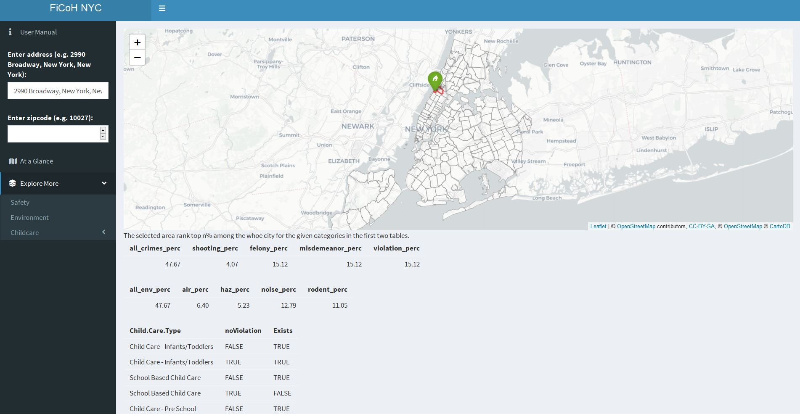

# FiCoH NYC (Find Cozy Home in NYC)

+ **Team Members**
	+ Young Sim
	+ Yanyan Liu
	+ Tongyu Wang

+ **Objective**: The goal of this project is to develope a Shiny App that lets home seekers explore living environment in different parts of NYC. All data used for the app are originally from [NYC Open Data]

+ **Summary**: While there are piles of listings out there to look at when you go house hunting, it is difficult to get to know the living environment of the area until you actually get to live there. People often end up making a contract for a unit just by looking at the interior and realizing that they do not like the area. There are more to consider than just price and commuting distance. FiCoH NYC will help you find a cozy home in New York City by letting you explore different areas in New York to see how the living environments like safety, pollution level, and even information on childcare centers are like for those of you with children.


+ At a Glance tab gives a summary of all three categories for the selected zip area. For crime and environment it shows rank of the region among the whole city in percentage, and for childcare it shows whether childcare center in each category exists in the selected area. More details follow in "Explore More".


+ Safety tab gives citywide safety information. User can give an address or an zipcode to find out about the safety level of the selected zip area compared to the rest of the city from boxplots in crime categories.


+ Environment tab includes information on pollution and rodent activity. User can give an address or an zipcode to find out about the environmental information of the selected zip area compared to the rest of the city from boxplots in crime categories.


+ Childcare tab includes information on citywide or nearby childcare centers. User can give conditions for desired centers and get the information for matching centers.


**Contribution statement**: All team members discussed and agreed on the topic of this project. All team members approve our work presented in this GitHub repository including this contributions statement. 

+ Young Sim cleaned crime data and generated map visualizations for Safety tab and At a Glance tab. She also cleaned data and generated boxplots for Safety tab and Environment tab as well as tables in At a Glance tab. She improved ui and server for Shiny App based on the baseline Shiny App for User Manual tab, At a Glance tab, Safety tab, and Environment tab.
+ Yanyan Liu cleaned E-designation data, rodent inspection data, and childcare data and generated map visualizations for environment tab and childcare tab. She improved ui and server for Shiny App based on the baseline Shiny App for User Manual tab, Environment tab, and Childcare tab.
+ Tongyu Wang developed baseline Shiny App and wrote draft for user manual script.

+ **Keywords: Data Visualization, Data Analysis, Data Cleaning, Geospatial Analysis, Shiny App, Interactive Dashboard, R**

Following [suggestions](http://nicercode.github.io/blog/2013-04-05-projects/) by [RICH FITZJOHN](http://nicercode.github.io/about/#Team) (@richfitz). This folder is orgarnized as follows.

```
proj/
├── app/ app files for the Shiny App (i.e., ui.r and server.r)
├── lib/ codes to generate preprocessed data
├── data/ data used in the analysis
├── doc/
└── output/ analysis output, processed datasets, logs, or other processed things
```

Please see each subfolder for a README file.

